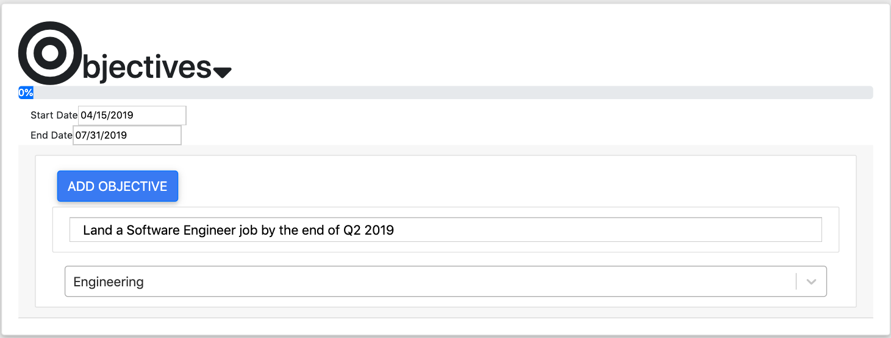
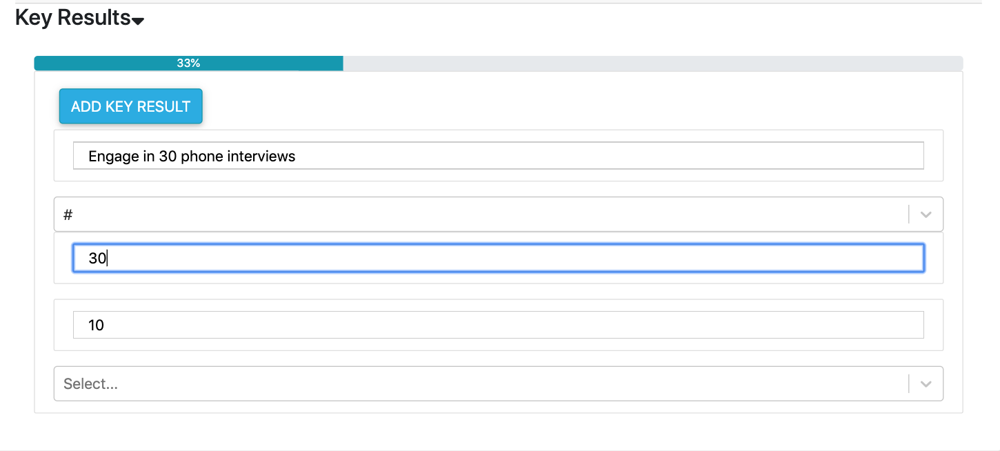
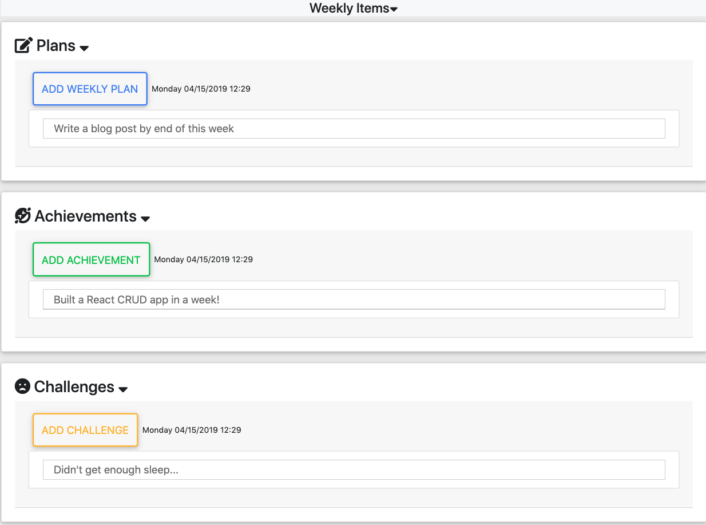
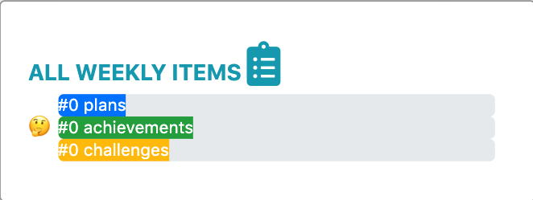
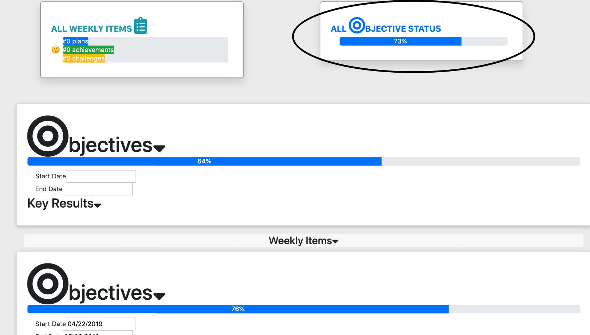

## SMART OKRS (SOKR) MVP BACKSTORY

[Link to Live Demo App](https://github.com/alexsjcho/smart-okr-react-app)

This project was a start-up idea I had inspired by my work exerience at 15Five and IFTTT.

When I was introduced to OKRs at 15Five, it just made so much sense to me and resonated with my own goal-oriented personality.

Then, when I was introduced to the world of IoT technologies at IFTTT, I thought: what if, I could create a goal management software that integrates with all the popular software tools that tech companies regularly use like Google Calendar, Zendesk, Salesforce, etc and automate goal management?

The idea of SOKR was born to help automate goals through the everyday tools you use daily.

This is accomplish by attaching tools to Key Results and automating the goal tracking on the Key Results level by integrating with commonly used software tools in tech companies.

This project only reflects the proof of concept from the UI perspective, in the future, I might create the backend for this project.

## PROJECT JOURNEY INSIGHTS

1. [Link to Live Demo App](https://github.com/alexsjcho/smart-okr-react-app)
2. [SOKR Product Development Roadmap Google Sheet ](https://docs.google.com/spreadsheets/d/1TXtMZzuoYQbTcidbsaGsN8lnYE67iHUw5Hx8yiXkN7E/edit?usp=sharing)
3. [Trello Board: Project Management](https://trello.com/b/aQDwaNUn/smartokrs)
4. [My Rendition of OKRs Blog](https://www.mraddoil.com/2019/02/10/okrs-goal-management-framework/)

## APP OVERVIEW

## 1. Objectives

Start by creating an objective with a start and end date, objective statement, and goal category

## 2. Key Results

Set Key Results related to your Objective, give them specific measurable metrics, and a measuable statement

## 3. Automate Your Key Results via Tools

Attach a Key Result with a software tool you would use to accomplish that goal and automate your efforts

## 4. Weekly Items

Log tasks associated with your Objectives, Key Results with Weekly Items (Plans, Achievements, Challenges)

## 5. Weekly Items Dashboard

Track all your Weekly Items and see different emoji faces reflect your progress

Weekly Items Dash

Weekly Plans

Weekly Achievements

Weekly Challenges

## 6. All Objective Dashboard

Track the progress of all your Objectives

## TECHNOLOGIES USED

1. HTML5
2. CSS3
3. Javascript
4. JSX
5. Bootstrap
6. React
7. Redux

## REACT LIBRARIES USED

1. [React Moments](https://github.com/headzoo/react-moment#readme)
2. [React Date Picker](https://github.com/Hacker0x01/react-datepicker/)
3. [React BootStrap](https://react-bootstrap.github.io/)
4. [React Select](https://github.com/JedWatson/react-select/tree/v1.x)

## TESTING TOOLS

1. React Chrome Extension
2. Redux Chrome Extension
3. Chrome Dev Tools
4. Jest
5. Enzyme
